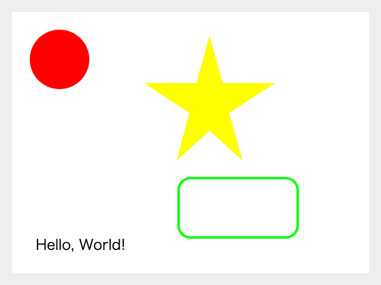

# bbcanvas

## 概要
Canvasへの描画において、``fillStyle`` 等の色指定と ``fillRect`` 等の描画処理を一括で行えるライブラリです。

## 使い方

本ライブラリを読み込むと、```CanvasRenderingContext2D``` に以下のメソッドが追加されます。
- `bbFill(path, color: string)`

  描画設定後、fillRectを実行します。
- `bbStroke(path, { color?: string, width?: number })`

  描画設定後、fillStrokeを実行します。

- `bbText(text: string, x: number, y: number, { color?: string, size?: number, font?: string, style?: string, align?: CanvasTextAlign, baseline?: CanvasTextBaseline, rotate?: boolean })`

  描画設定後、fillTextを実行します。

- `bbMeasureText(text: string, x: number, y: number, { size?: number, font?: string, style?: string }): number`

  描画設定後、measureTextを実行し、文字列の幅を返します。

`path` には、以下の構造のオブジェクトを設定します。
```js
{
  // 長方形 (＋角丸)
  rect: [x: number, y: number, width: number, height: number],
  radius?: number
} | {
  // 円
  center: { x: number, y: number },
  radius: number
} | {
  // ポリゴン
  points: [x: number, y: number][]
}
```

## 描画例


## ソースコード
対応するCanvasAPIのコードをコメントで示しています。
```js
const canvas = document.getElementById('canvas');
const ctx = canvas.getContext('2d');

// ctx.fillStyle = '#eeeeee';
// ctx.fillRect(0, 0, 640, 480);
// ctx.fillStyle = '#ffffff';
// ctx.fillRect(20, 20, 600, 440);
ctx.bbFill({ rect: [0,0, 640, 480] }, '#eeeeee');
ctx.bbFill({ rect: [20, 20, 600, 440] }, '#ffffff');

// ctx.fillStyle = '#ff0000';
// ctx.beginPath();
// ctx.arc(100, 100, 50, 0, 2 * Math.PI);
// ctx.fill();
ctx.bbFill({ center: {x: 100, y: 100}, radius: 50 }, '#ff0000');

// ctx.fillStyle = '#000000';
// ctx.font = '24px sans-serif';
// ctx.textBaseline = 'top';
// ctx.fillText('Hello, ', 60, 400);
// const offset = ctx.measureText('Hello, ').width;
// ctx.fillText('World!', 60 + offset, 400);
ctx.bbText('Hello, ', 60, 400, { size: 24, color: '#000000' })
const offset = ctx.bbMeasureText('Hello, ', { size: 24 });
ctx.bbText('World!', 60 + offset, 400, { size: 24, color: '#000000' })

// ctx.fillStyle = '#808000';
// ctx.lineWidth = 4;
// ctx.beginPath();
// ctx.moveTo(352, 60);
// ctx.lineTo(374, 140);
// ctx.lineTo(462, 140);
// ctx.lineTo(385, 190);
// ctx.lineTo(407, 270);
// ctx.lineTo(352, 220);
// ctx.lineTo(297, 270);
// ctx.lineTo(318, 190);
// ctx.lineTo(242, 140);
// ctx.lineTo(330, 140);
// ctx.closePath();
// ctx.fill();
ctx.bbFill(
	{
		points: [[352, 60], [374, 140], [462, 140], [385, 190], [407, 270], [352, 220], [297, 270], [318, 190], [242, 140], [330, 140]]
	},
	'#ffff00'
);

ctx.bbStroke(
	{
		rect: [300, 300, 200, 100],
		radius: 20,
	},
	{ width: 4, color: '#00ff00' }
)
```
